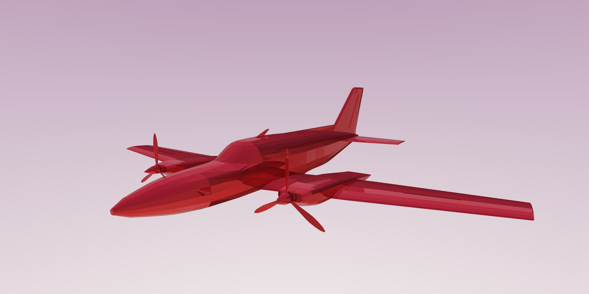

# Spectral

A physically-based path tracer. Mostly serves as my playground for trying out new things I find online!

## References

- [Ray Tracing in One Weekend](https://raytracing.github.io/books/RayTracingInOneWeekend.html)
- [Physically Based Rendering](https://www.pbr-book.org/3ed-2018/Introduction)
- [Scratchapixel](https://www.scratchapixel.com/)
- [Original Disney BRDF paper](https://media.disneyanimation.com/uploads/production/publication_asset/48/asset/s2012_pbs_disney_brdf_notes_v3.pdf)
- [Disney BSDF paper](https://blog.selfshadow.com/publications/s2015-shading-course/burley/s2015_pbs_disney_bsdf_notes.pdf)
- [UCSD Disney BSDF assignment](https://cseweb.ucsd.edu/~tzli/cse272/wi2023/homework1.pdf)
- [A blog on implementing the Disney BSDF](https://schuttejoe.github.io/post/disneybsdf/)